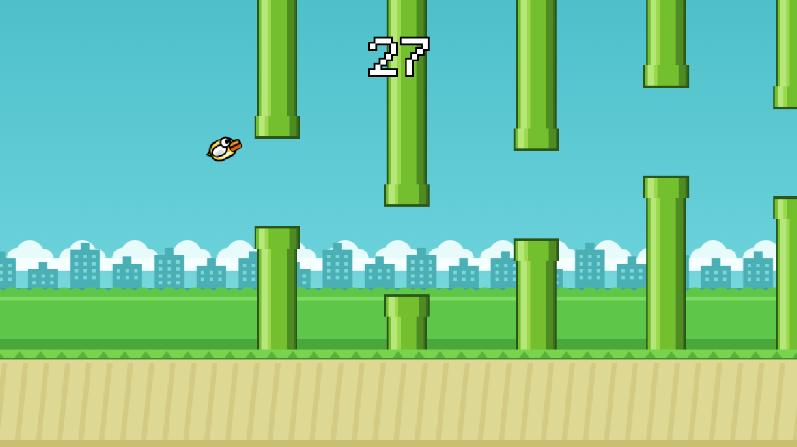
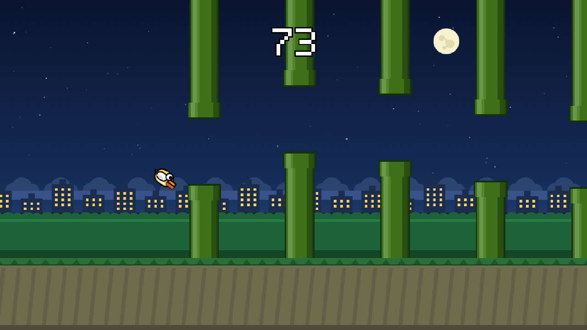
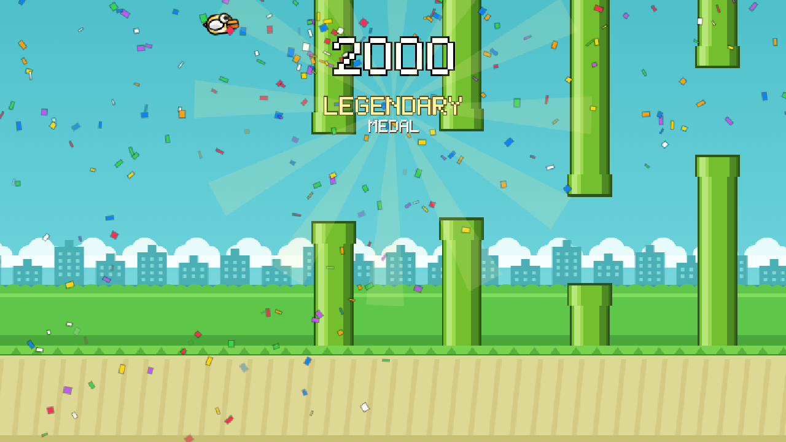

<h1 align="center">🐤 Flappy Bird</h1>

<p align="center">
  <strong>A complete Flappy Bird in a single HTML file.</strong><br>
  No build step, no dependencies, no image or audio assets —<br>
  every pixel is drawn in code and every sound is synthesised on the fly.
</p>

<p align="center">
  
  
</p>

---

## Play

Double-click `index.html`. That is the entire install — 44 KB of static HTML with zero requests.

Or serve the folder however you like: VS Code Live Server, `python -m http.server`, anything.

| Action | Keys |
| :-- | :-- |
| Flap | `Space` · `↑` · `W` · `Enter` · click · tap |
| Pause | `P` · `Esc` |
| Mute | `M` |

Your best score and the world's time of day both survive a reload.

---

## What's in it

### 🏅 A medal ladder worth chasing

Crossing a medal threshold mid-run fires a celebration whose size comes from the tier, so there is always a next thing to reach for.

| Score | Medal | What fires |
| --: | :-- | :-- |
| 10 | **Bronze** | confetti burst off the bird, banner, fanfare |
| 20 | **Silver** | ” |
| 30 | **Gold** | confetti keeps raining while the banner is up |
| 50 | **Platinum** | ” |
| 100 | **Diamond** | fireworks pop across the sky |
| 200 | **Emerald** | ” |
| 500 | **Master** | a sunburst behind the banner, colour wash |
| 1000 | **Grandmaster** | ” |
| 2000 | **Legendary** | everything, in rainbow |

<p align="center"></p>

The whole ladder is one table in the source — a tier's *index* in it is the strength of its flare, so a new medal is a one-line addition and the reward can never drift from the celebration.

### 🌙 Day and night

Every 50 pipes the world turns over. It eases across about a second and a half rather than cutting, so it reads as dusk falling: the sky deepens, stars come out, a moon rises, and the skyline windows light up amber.

The phase belongs to the **world, not the run** — die at night and the next attempt starts at night, and it is remembered across reloads.

### 📐 Fills any screen, without breaking the game

The canvas covers the whole window at any size or aspect ratio, with no letterboxing and no stretching — one uniform zoom, set by whichever screen dimension runs out of room for the classic 288 × 512 frame first.

Crucially the **playable band stays exactly 400 px tall on every screen**. A taller field would place consecutive gaps further apart than the bird can physically climb between pipes, which is unwinnable through no fault of the player. Spare room becomes zoom and extra width instead.

---

## How it works

<table>
<tr><td><strong>Fixed timestep</strong></td><td>The simulation runs at a locked 60 Hz with a render on every animation frame, so physics are identical on a 60 Hz laptop and a 240 Hz monitor.</td></tr>
<tr><td><strong>One coordinate system</strong></td><td>Everything is authored in classic Flappy pixels. The browser does the scaling, with nearest-neighbour upscaling to keep the blocks hard.</td></tr>
<tr><td><strong>Palette table</strong></td><td>Every colour that changes with the time of day lives in a <code>DAY</code>/<code>NIGHT</code> pair and is mixed once per frame into a live palette. The drawing code only ever reads that palette.</td></tr>
<tr><td><strong>Hand-built 5 × 7 font</strong></td><td>Every glyph is a bitmap in the source, drawn as rectangles. No web fonts, no text rendering.</td></tr>
<tr><td><strong>Synthesised audio</strong></td><td>Flap, score, hit, and the escalating medal fanfare are all Web Audio oscillators. No files.</td></tr>
<tr><td><strong>Reachable by design</strong></td><td>Pipe gaps are generated against what the bird can actually climb and fall between pipes, so an impossible jump can't be dealt.</td></tr>
</table>

---

## Layout

```text
index.html    the entire game — markup, styles, engine, art, audio
docs/         screenshots for this README
```
